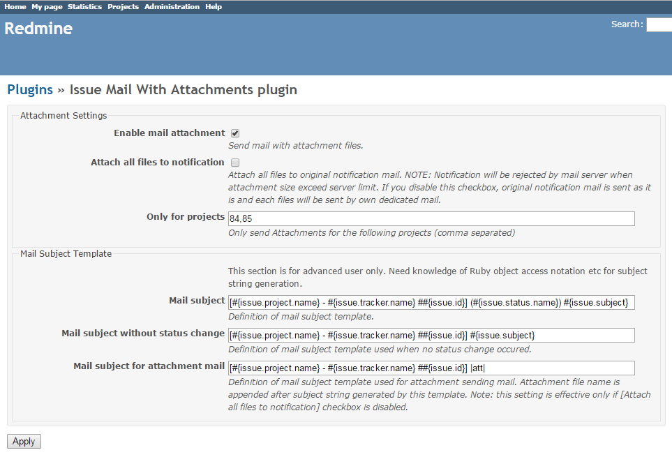

# Redmine issue_mail_with_attachments plugin

With this plugin, you can mail out new attachment files on Issue pages via issue notification mails.

## Installation
1. Downloaded and extract plugin zip file.
2. Copy "issue_mail_with_attachments" folder under "src" folder into redmine's "plugins" folder.
3. Restart your Redmine servers.

## Setup
1. Login to your redmine with admin privilege account.
2. Open \[Administration] > [Plugins], click [Configure] link on [Issue Mail With Attachments plugin].
3. Set plugin configurations. Note:
   - With disabling [Attach all files to notification] checkbox, each attachments are sent out via dedicated mails (default/recommend setting).
   - If enabling [Enable project level control] checkbox, to enable plugin function in each projects, you need to enable [issue mail with attachments plugin] item in each project's Settings page.
   - With entering custom filed name in [Custom field name to enable attachment] field, you can control each issue level attachment or not by enabling/disabling defined custom field (Boolean-format) of this name.

Configuration UI

Chinese Configuration UI

Japanese Configuration UI

## Usage
1. Manipulate Redmine issues as usual, issue attachment files are sent out with notification mails at the time of issue creation and update.

## Compatibility
Redmine 3.0 to 3.4
Ruby 2.0 or above